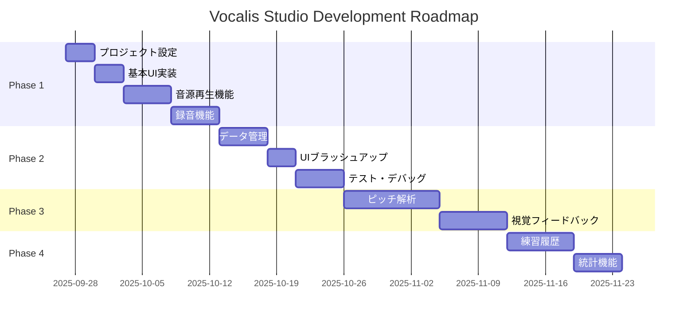

# 開発ロードマップ - Vocalis Studio

## 開発フェーズ概要

## Phase 1: MVP開発（2025年10月〜11月）

### Week 1-2: プロジェクトセットアップ
- [ ] Xcodeプロジェクト作成
- [ ] 基本的なプロジェクト構造の構築
- [ ] Git リポジトリ設定
- [ ] 開発環境の整備

### Week 3-4: 基本UI実装
- [ ] SwiftUI基本画面レイアウト
- [ ] ナビゲーション構造
- [ ] 基本的なUIコンポーネント作成

### Week 5-6: 音源再生機能
- [ ] 5トーンスケール音源の準備
- [ ] AVAudioPlayer実装
- [ ] 再生コントロール（再生/停止/テンポ調整）
- [ ] 音量調整機能

### Week 7-8: 録音機能
- [ ] AVAudioRecorder実装
- [ ] マイク権限リクエスト
- [ ] 同時録音（音源再生中の録音）
- [ ] 録音レベルメーター表示

### マイルストーン
- **MVP完成**: 基本的な録音と再生が可能なアプリ

## Phase 2: 品質向上とデータ管理（2025年11月〜12月）

### Week 9-10: データ管理機能
- [ ] 録音ファイルの保存機能
- [ ] 録音リスト表示
- [ ] 録音の再生機能
- [ ] 録音の削除機能

### Week 11: UIブラッシュアップ
- [ ] アニメーション追加
- [ ] ダークモード対応
- [ ] アクセシビリティ対応

### Week 12-13: テストとデバッグ
- [ ] ユニットテスト作成
- [ ] UIテスト作成
- [ ] 実機テスト
- [ ] バグ修正とパフォーマンス改善

### マイルストーン
- **ベータ版リリース**: TestFlight配信可能な品質

## Phase 3: 高度な機能追加（2026年1月〜2月）

### ピッチ解析機能
- [ ] リアルタイムピッチ検出
- [ ] 音程精度の計算
- [ ] 目標音程との比較機能

### 視覚的フィードバック
- [ ] 音程グラフ表示
- [ ] リアルタイム波形表示
- [ ] 練習スコア表示

### マイルストーン
- **Version 1.1**: 分析機能を備えた本格的なトレーニングアプリ

## Phase 4: ユーザー体験向上（2026年3月〜）

### 練習履歴管理
- [ ] カレンダービュー
- [ ] 練習時間統計
- [ ] 進捗グラフ

### 追加音源パターン
- [ ] アルペジオ
- [ ] メジャースケール
- [ ] マイナースケール
- [ ] カスタム音階

### マイルストーン
- **Version 2.0**: フル機能版リリース

## 将来の拡張計画（2026年後半〜）

### クラウド連携
- iCloud同期
- データバックアップ
- 複数デバイス対応

### ソーシャル機能
- 進捗共有
- オンラインレッスン連携
- コミュニティ機能

### AI機能
- 自動採点
- 練習提案
- パーソナライズされたトレーニングプラン

## リリース計画

| バージョン | リリース予定 | 主な機能 |
|---------|----------|--------|
| 0.1.0 | 2025年11月 | 内部テスト版（基本機能） |
| 0.2.0 | 2025年12月 | TestFlight ベータ版 |
| 1.0.0 | 2026年1月 | App Store初回リリース |
| 1.1.0 | 2026年2月 | ピッチ解析機能追加 |
| 2.0.0 | 2026年4月 | フル機能版 |

## KPI（重要業績評価指標）

### 技術指標
- クラッシュ率: < 0.5%
- 起動時間: < 2秒
- 音声遅延: < 50ms

### ユーザー指標
- DAU（日次アクティブユーザー）: 1000+
- 継続率（7日後）: 40%+
- App Store評価: 4.0+

## リスク管理

### 技術リスク
| リスク | 影響度 | 対策 |
|-------|-------|------|
| 音声同期の精度問題 | 高 | 早期プロトタイプで検証 |
| パフォーマンス問題 | 中 | 定期的なプロファイリング |
| デバイス互換性 | 中 | 複数実機でのテスト |

### ビジネスリスク
| リスク | 影響度 | 対策 |
|-------|-------|------|
| 競合アプリの出現 | 中 | 差別化機能の早期実装 |
| ユーザー獲得困難 | 高 | MVP段階からフィードバック収集 |

## 開発体制

### 必要なリソース
- iOS開発者: 1名
- UI/UXデザイナー: 必要に応じて
- テスター: 2-3名（ベータ版以降）

### コミュニケーション
- 週次進捗レビュー
- 隔週でのユーザーテスト
- 月次でのKPIレビュー